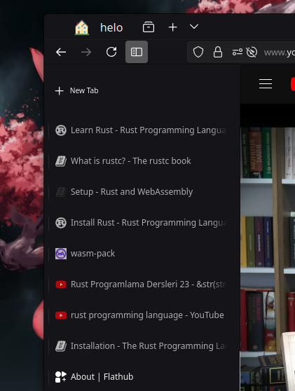

## Temel özellikler

Hüma, yerli ve açık kaynaklı bir web tarayıcısıdır. Firefox tabanlı olarak geliştirilen bu tarayıcı, gizlilik odaklı tasarımı ve özelleştirilebilir özellikleriyle öne çıkar. Hüma, kendi temasının yanı sıra sayfalar arasında gezinmeyi kolaylaştıran Hüma Gezgini, dikey sekme desteği, internetsiz çalışan Hüma Tarih ve Mitoloji sayfaları, dosya paylaşımı için 10MB sınırı olan Hüma Bulut ve Türkçe söz dizimine sahip betik yazma aracı Hüma Betik gibi özellikler sunar. Pardus ekosistemine katkı sağlamayı amaçlayan Hüma, Türk mitolojisi ve tarihi hakkında da bilgi içermektedir. 

:::note
Hüma sürekli geliştirilmektedir yeni özellikleri edinmek için tarayıcının güncel olduğundan emin olun
:::

## Dikey Sekmeler

Dikey sekmeler: Hüma Tarayıcısı için Yenilikçi Dikey Sekme Eklentisi

Dikey sekmeler, Hüma tarayıcısında kullanıcı deneyimini büyük ölçüde iyileştiren bir dikey sekme eklentisidir. Geliştirilmiş kullanılabilirlik ve özelleştirme seçenekleri sunarak, web gezintisini daha verimli ve düzenli hale getirir.

### **Özellikler:**

    - Dikey Sekmeler: Web sitelerini dikey sekme düzeninde göstererek daha fazla sekme kullanımını optimize eder.
    - Özelleştirilebilirlik: Sekme genişlikleri, renk temaları ve düzen seçenekleriyle kullanıcıya tam kontrol sağlar.
    - Sekme Grupları: Sekmeleri gruplayarak benzer içeriklere sahip web sitelerini kolayca yönetebilme imkanı sunar.
    - Sürükle ve Bırak Desteği: Sekmeleri sürükleyerek yeniden düzenleme ve gruplama yapabilme kolaylığı sağlar.
    - Performans Odaklı: Hafif yapısıyla tarayıcı performansını olumsuz etkilemeden kullanıcıya yüksek performans sunar.

## Hüma Gezgini

**Hüma Gezgini:** Hüma tarayıcısının ana içeriği olarak işlev gören ve kullanıcıların farklı özellikler ve araçlar arasında geçiş yapmalarını sağlayan kapsamlı bir özelliktir.

Hüma Gezgini, Hüma Başlangıç sayfasındaki araçları içeren ve ek özellikler sunan bir yapıdır. Bu yapı, kullanıcıların tarayıcı deneyimlerini kişiselleştirmelerine ve organize etmelerine yardımcı olur.

### **Özellikler:**
- **Hüma İçerik:** Kullanıcıların beğendikleri makaleleri kaydedebilmelerini ve daha sonra okumalarını sağlar. Kaydedilen içeriklere Hüma Başlangıç sayfasından erişilebilir.
- **Hüma Gözlem Odası:** Kullanıcıların tarayıcı etkinliklerini grafiklerle görselleştirir ve alışkanlık takibi yapar. Bu özellik, kullanıcının tarayıcı alışkanlıklarını analiz etmesine yardımcı olur.
- **Tarayıcı Yönetimi:** Hüma Gezgini tarayıcının olmazsa olmaz bir parçasıdır. Tarayıcının eklenti tarafından eksiklerini gidererek tarayıcıya cb

Hüma Gezgini, Hüma Başlangıç sayfasındaki araçları kapsayan ve kullanıcıların tarayıcı deneyimlerini daha verimli bir şekilde yönetmelerine olanak tanıyan geniş bir yapıdır.

 
 
 
## Hüma Kenar Çubuğu

**Hüma Kenar Çubuğu:** Kullanıcıların web sitelerini ve eklentileri kenar çubuğunda açabilmelerini sağlayan bir özelliktir.

Hüma Kenar Çubuğu, web panelinde birden fazla eklentiyi bir arada görüntüleyebilmenizi sağlar. Web sayfalarında bu özellik, yalnızca belirli bir web sayfası ile sınırlıdır. Kenar çubuğunda eklentiler ve tarayıcı içi sayfalar, görünüme ve kullanım rahatlığına zarar vermemesi için bu sınırlamalara tabidir.

### **Özellikler:**
- **Web ve Eklenti Yönetimi:** Web sitelerini ve eklentileri kenar çubuğunda yönetebilirsiniz.
- **Eklenti Kullanımı:** Web panelinde birden fazla eklentiyi aynı anda görüntüleyebilirsiniz.
- **Yer Tasarrufu:** İki kenar çubuğunda aynı anda iki veya daha fazla eklentiyi kullanarak alan tasarrufu sağlar.

Hüma Kenar Çubuğu, kullanıcıların verimli bir şekilde eklentileri ve web sitelerini yönetmelerine yardımcı olur.

 